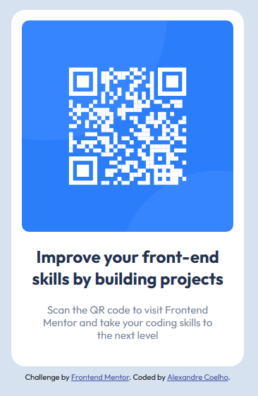

# Frontend Mentor - QR code component solution

Está é uma solução para o [QR code component challenge on Frontend Mentor](https://www.frontendmentor.io/challenges/qr-code-component-iux_sIO_H).

My English is not that advanced, so I apologize if there are any mistakes. (O meu inglês não é assim tão avançado, por isso peço desculpa se houver algum erro.)

## Tabela de Conteúdos

- [Overview (Visão Geral)](#visão-geral)
  - [Screenshot](#screenshot)
  - [Links](#links)
- [My process (O meu processo)](#my-process)
  - [Built with (Construído com)](#built-with)
  - [Continued development (Desenvolvimento continuado)](#continued-development)
- [Author (Autor)](#author)

## Overview (Visão Geral)

### Screenshot

### Links

- Solution URL(URL da Solução): [Repository (Repositório)](https://github.com/coelhoalexandre/frontendmentor/tree/main/qr-code-component-main)

- Live Site URL: [GitHub Pages](https://coelhoalexandre.github.io/frontendmentor/qr-code-component-main/)

- FrontendMentor Repository(Repositório FrontendMentor): [Repository (Repositório)](https://github.com/coelhoalexandre/frontendmentor)

## My process (O meu processo)

I started by creating the HTML structure, already thinking about the Flexbox application. 

I applied a CSS reset that I saw from one of my favorite youtuber.

Then I kept styling the containers until I thought it was very similar to the design.

I did all the styling thinking primarily for mobile, but I didn't even need to style for Desktop because it is already adequate.

(Comecei criando a estrutura HTML, já pensando na aplicação da Flexbox.

Apliquei um reset CSS que acabei vendo de uma das minhas youtuber favoritas.

Por fui estilizando os container até eu acreditar que estava muito parecido com o da design.

Fiz todo o estilo pensando primariamente para o celular, porém nem precisei fazer estilos para Desktop em razão de já está adequado.)

### Built with (Construído com)

- Semantic HTML5 markup (Marcação HTML5 semântica)
- CSS custom properties (Propriedades personalizadas do CSS)
- Flexbox
- Mobile-first workflow (Fluxo de trabalho móvel-primeiro)
- Virtual Studio Code

### Continued development (Desenvolvimento continuado)

I want to understand more about it:

- Reset CSS
- Flexbox
- Grid Layout

It was this content that I kept thinking about the most while doing this challenge.

(Pretendo entender melhor sobre:

- Reset CSS
- Flexbox
- Grid Layout

Foram estes conteúdos que mais fiquei pensando enquanto fazia este desafio.)

## Author (Autor)

- Frontend Mentor - [@coelhoalexandre](https://www.frontendmentor.io/profile/coelhoalexandre)
- GitHub - [coelhoalexandre](https://github.com/coelhoalexandre)
